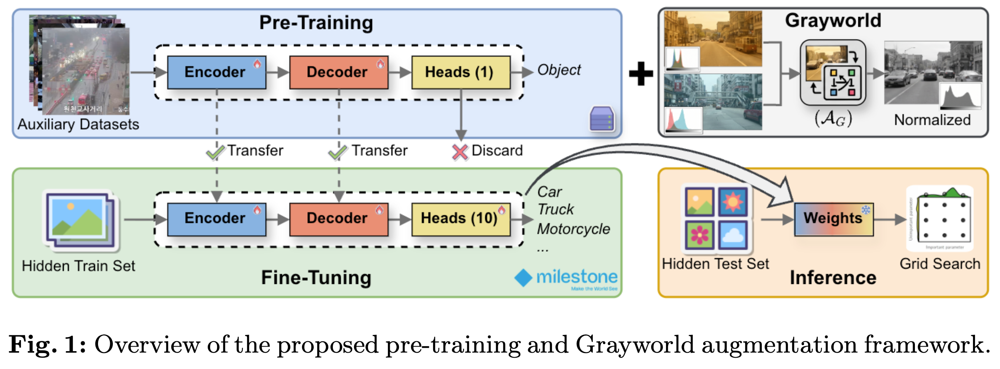
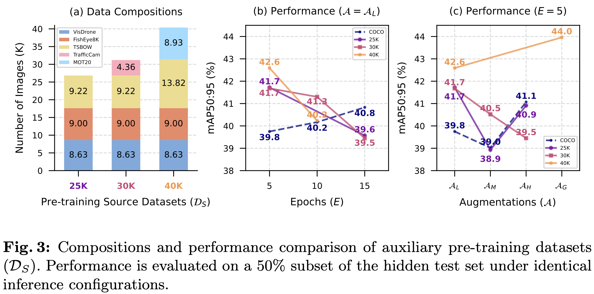
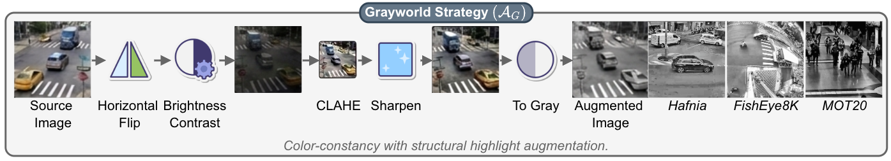
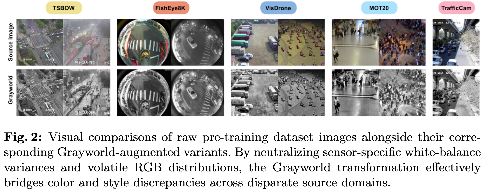

<h1 align='center'>
    Rethinking Pre-Training and Augmentation<br>
    for Zero-Shot Cross-City Object Detection
</h1>

<p align='center'>
    <!-- 🏆 Winner of the 10th AI City Challenge Track 6: Cross-City Object Detection -->
</p>


<!-- MARK: authors -->
<div align='center'>
    <a href="https://scholar.google.com/citations?user=xPyle9AAAAAJ&hl">
        Long Hoang Pham</a> &emsp;
    <a href="https://scholar.google.com/citations?user=hpPU1ugAAAAJ&hl">
        Quoc Pham-Nam Ho</a> &emsp;
    <a href="https://scholar.google.com/citations?user=jxoCog4AAAAJ&hl">
        Huy-Hung Nguyen</a>
</div>

<div align='center'>
    Duong Nguyen-Ngoc Tran &emsp;
    Ngoc Doan-Minh Huynh &emsp;
    Cu Quoc Le &emsp;
</div>

<div align='center'>
    Hoang Khang Nguyen &emsp;
    Hyung-Min Jeon &emsp;
    Chi Dai Tran &emsp;
    Son Hong Phan
</div>

<div align='center'>
    Duong Khac Vu &emsp;
    Trinh Le Ba Khanh &emsp;
    <a href="https://scholar.google.com/citations?user=9z0SfKoAAAAJ">
        Jae Wook Jeon</a>
</div>

<!-- affiliation -->
<div align='center'>
    <a href="https://micro.skku.ac.kr/micro/index.do">Automation Lab</a>
    <p>Sungkyunkwan University</p>
</div>

<div align='center'>
    <b>Contacts:</b> <a href="mailto:phlong@skku.edu">phlong@skku.edu</a>, <a href="mailto:jwjeon@skku.edu">jwjeon@skku.edu</a>
</div>


<!-- MARK: URLs -->
<!-- get img shields at: -->
<!-- https://shields.io/badges -->
<!-- check icon at: -->
<!-- https://github.com/simple-icons/simple-icons/blob/master/slugs.md  -->
<br>

<div align="center">
  <a href="https://github.com/SKKUAutoLab/aic26_cross_city"></a>
  <!-- <a href="https://doi.org/10.1609/aaai.v40i7.37439"></a> -->
  <a href="https://github.com/SKKUAutoLab/aic26_cross_city"></a>
</div>


<!-- MARK: News -->

## 🎉 NEWS

- [2026.08.02] 💽 Our data and pretrained weights are released!
- [2026.08.01] 📄 Our paper is accepted at ECCVW.
- [2026.07.29] 💻 Our code is released!
- [2026.07.24] 📄 Our paper is under review at ECCVW.


<!-- MARK: Abstract -->

## 📝 Abstract

Real-world deployment of traffic surveillance systems is bottlenecked by geographic domain shift, in which models 
trained in one city underperform when applied to an unseen target city. Conventional domain adaptation relies on 
hyperparameter-sensitive architectures or direct profiling of target data. Both are fundamentally precluded in 
privacy-conscious ecosystems that require completely blind training and evaluation loops. In this setting, we explore 
the effects of pre-training and augmentation on addressing the domain shift problem. Specifically, we propose a new 
modular training pipeline for object detection structured around two core orthogonal pillars: (1) a multi-dataset 
pre-training strategy featuring a class-agnostic objectness distillation to decouple structural vehicle geometry from 
semantic taxonomies, and (2) a domain-resilient augmentation stream featuring a novel Grayworld transformation that 
forces global attention headers to strip volatile chromatic shortcuts in favor of robust shape priors. When evaluated 
with the real-time transformer-based detector RF-DETR, our framework bridges cross-city distribution gaps while using 
limited GPU memory (16GB). Our optimized variants, RF-DETR-HR and RF-DETR-Grayworld, deliver substantial empirical 
+24.29 gains over the baseline, achieving 1st place (mAP 47.53) on the AI City Challenge Track 6 leaderboard.


<!-- MARK: Overview -->

## 🌍 Overview

<div align="center">
    
</div>

Our approach addresses cross-city domain degradation through two core techniques:
- **Class-Agnostic Pre-Training**: Collapsing semantic labels into a unified binary objectness task to decouple vehicle structural geometry from volatile category taxonomies across a 40K-image dataset.
<div align="center">
    
</div>

- **Grayworld Chromatic Neutralization**: Stripping sensor-dependent color shortcuts to force global attention heads to prioritize robust, domain-invariant shape priors.

<div align="center">
    
    
</div>


<!-- MARK: Install -->

## 📥 Install

To test our solution, please clone this repository:

```bash
git clone https://github.com/SKKUAutoLab/aic26_cross_city
cd aic26_cross_city
poetry install
```

<details>
  <summary>Directory Structure</summary>

  ```text
  aic26_cross_city/                     # Project root.
  |__ data/                             # Custom pre-training datasets.
  |__ docker/                           # Docker files for experiments.
  |__ run/                              # Local training/evaluation artifacts.
  |__ src/
  |   |__ trainer_object_detection/     # Main project source code.
  |__ tools/                            # Some useful scripts.
  |__ .dockerignore
  |__ .gitignore
  |__ pyproject.toml
  |__ README.md
  ```
</details>

<br>

<b>The pre-training data, weights, and dockers can be found at [Google Drive](https://drive.google.com/drive/folders/1mZKpR_ERcPv7n8OewJLFK_OJ1Qze-9k6?usp=sharing).</b>


<!-- MARK: Run -->

## 🔬 Run Code

### Prepare Trainer

We have prepared two [dockers](https://drive.google.com/drive/folders/1mZKpR_ERcPv7n8OewJLFK_OJ1Qze-9k6?usp=sharing):
- trainer-RFDETR2XLarge_40k.zip
- trainer-RFDETR2XLarge_40k_1080.zip

The provided docker only contains our best pretrained weights. 
If you want to try other weights, please copy it from the [model zoo](https://drive.google.com/drive/folders/1mZKpR_ERcPv7n8OewJLFK_OJ1Qze-9k6?usp=sharing) to `src/trainer_object_detection/pretrained_models/` and build the docker:

```bash
cd src/trainer_object_detection
hafnia trainer create-zip .
```

Then, upload the trainer docker to [Hafnia Milestone System](https://hafnia.milestonesys.com/)

### RF-DETR-HR (mAP 47.53)

To test the RF-DETR-HR solution, use the provided `trainer-RFDETR2XLarge_40k_1080.zip`.

- Training command:
    ```bash
    python scripts/train.py --model_path pretrained_models/RFDETR2XLarge_40k_1080_e00.zip --epochs 5 --batch-size 1 grad-accum-steps 16 --resolution 1080 --aug-config simple --run-train --infer-resolution 1080
    ```
- Inference command:
    ```bash
    python scripts/train.py --model_path pretrained_models/RFDETR2XLarge_40k_1080_e05_simple.zip --resolution 1080 --infer-threshold 0.018 --infer-resolution 2400
    ```

### RF-DETR-Grayworld (mAP 46.63)

To test the RF-DETR-Grayworld solution, use the provided `trainer-RFDETR2XLarge_40k.zip`.

- Training command:
    ```bash
    python scripts/train.py --model_path pretrained_models/RFDETR2XLarge_40k_e00_gray.zip --epochs 5 --batch-size 2 grad-accum-steps 8 --resolution 880 --aug-config gray --run-train --infer-resolution 880 --infer-grayscale
    ```
- Inference command:
    ```bash
    python scripts/train.py --model_path pretrained_models/RFDETR2XLarge_40k_e05_gray.zip --resolution 880 --infer-threshold 0.018 --infer-resolution 2200 --infer-grayscale
    ```

### Pre-Train

You can perform pre-train on the provided [class-agnostic dataset](https://drive.google.com/drive/folders/1mZKpR_ERcPv7n8OewJLFK_OJ1Qze-9k6?usp=sharing) with our provided script: `tools/pretrain.py`. Please adjust the training configuration according to your machine.


<!-- MARK: References -->

## 📚 References

Thanks to the developers and contributors of the following open-source repositories, whose invaluable work has greatly inspire our project:

**Datasets**:
- [TSBOW](https://github.com/SKKUAutoLab/TSBOW): A traffic surveillance benchmark for occluded vehicles under various weather conditions.
- [TrafficCAM](https://math-ml-x.github.io/TrafficCAM/): A versatile dataset for traffic flow segmentation.
- [FishEye8K](https://github.com/MoyoG/FishEye8K): A benchmark and dataset for fisheye camera object detection.
- [VisDrone](https://github.com/VisDrone/VisDrone-Dataset): A drone-based detection and tracking dataset, including both image/video, and annotations.
- [MOT20](https://github.com/JonathonLuiten/TrackEval/tree/master): A benchmark for single-camera multiple target tracking.

**Github Repo**:
- [Hafnia Trainer Package](https://github.com/milestone-hafnia/trainer-object-detection): An object detection trainer package for Hafnia Training-as-a-Service.
- [RF-DETR](https://github.com/roboflow/rf-detr): A real-time object detection and segmentation model architecture developed by Roboflow.
- [Ultralytics YOLO](https://github.com/ultralytics/ultralytics): Detection models for training and real-time inferencing.


<!-- MARK: Citation -->

## 🏅 Citation

If this research is helpful to you, please cite our paper using the following BibTeX format:

```bibtex
@INPROCEEDINGS{Pham2026Rethinking,
    author    = {Long Hoang Pham, Quoc Pham-Nam Ho, Huy-Hung Nguyen, Duong Nguyen-Ngoc Tran, Ngoc Doan-Minh Huynh, Cu Quoc Le, Hoang Khang Nguyen, Hyung-Min Jeon, Chi Dai Tran, Son Hong Phan, Duong Khac Vu, Trinh Le Ba Khanh, and Jae Wook Jeon},
    title     = {Rethinking Pre-Training and Augmentation for Zero-Shot Cross-City Object Detection},
    booktitle = {European Conference on Computer Vision Workshops (ECCVW)},
    year      = {2026},
}
```


<!-- MARK: Git Stats -->

<!--  -->

<!--  -->

<!-- <div style="position: relative; display: inline-block;">
  
  
</div> -->

<div align="center"><a href="#top">🔝 Back to Top</a></div>
